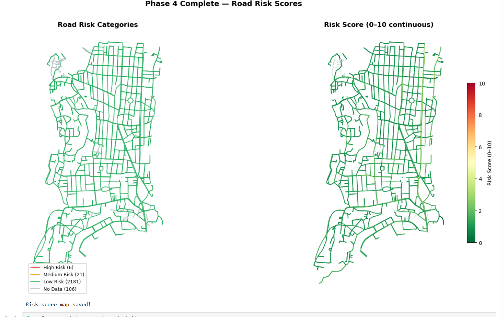

# Mumbai Road Quality Risk Explorer 🗺️

An end-to-end geospatial analysis of road surface risk in **Bandra West, Mumbai**,
built using OpenStreetMap road data, civic complaint records, and Python geospatial tools.

Developed as a portfolio project targeting geospatial and location intelligence roles.

---

## Live Demo

Open `outputs/mumbai_road_risk_map.html` in any browser — no installation needed.

---

## Screenshot



---

## What This Project Does

1. Downloads the complete road network of Bandra West from OpenStreetMap
2. Loads/generates civic road complaint data with location, type, and severity
3. Spatially joins complaint points to their nearest road segment (within 50m)
4. Computes a weighted risk score for every road:
```
   Risk Score = 0.5 × (pothole density per km)
              + 0.3 × (traffic volume proxy)
              + 0.2 × (road type vulnerability)
              × monsoon multiplier
```
5. Visualises results as an interactive Folium map with tooltips, layer controls,
   and an automated key findings panel


---

## Project Structure
```
mumbai-road-risk/
├── notebooks/
│   └── mumbai_road_risk.ipynb    # Full analysis notebook
├── data/
│   ├── roads_bandra.gpkg         # OSM road network
│   ├── complaints_bandra.gpkg    # Complaint point data
│   ├── roads_with_counts.gpkg    # Roads + complaint counts
│   └── roads_scored.gpkg         # Roads + risk scores
├── outputs/
│   ├── mumbai_road_risk_map.html # Interactive Folium map
│   ├── chart1_risk_distribution.png
│   ├── chart2_top10_roads.png
│   ├── chart3_road_type_analysis.png
│   ├── chart4_monthly_trend.png
│   ├── chart5_factor_analysis.png
│   └── insights_report.txt
└── README.md
```

---

## Tech Stack

| Tool | Purpose |
|------|---------|
| OSMnx | Road network download from OpenStreetMap |
| GeoPandas | Spatial joins and geometry operations |
| Folium | Interactive web map |
| Matplotlib / Seaborn | Analytics charts |
| scikit-learn | MinMaxScaler for normalisation |
| Jupyter Notebook | Analysis narrative |

---


